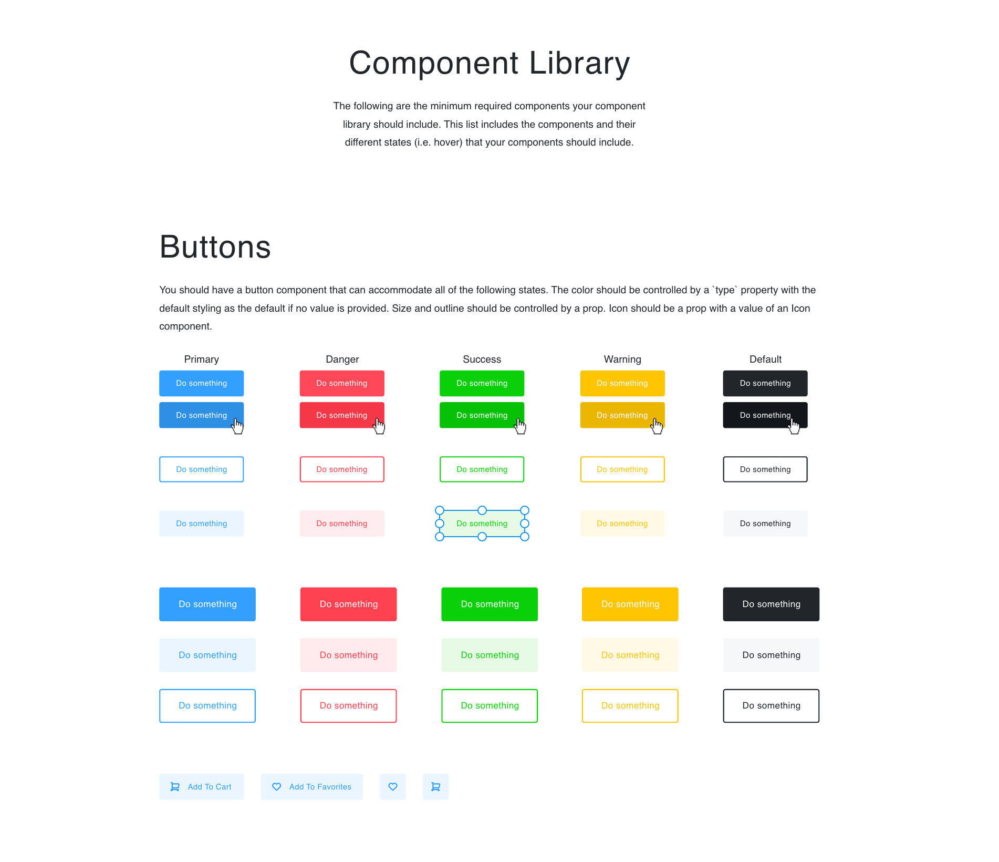
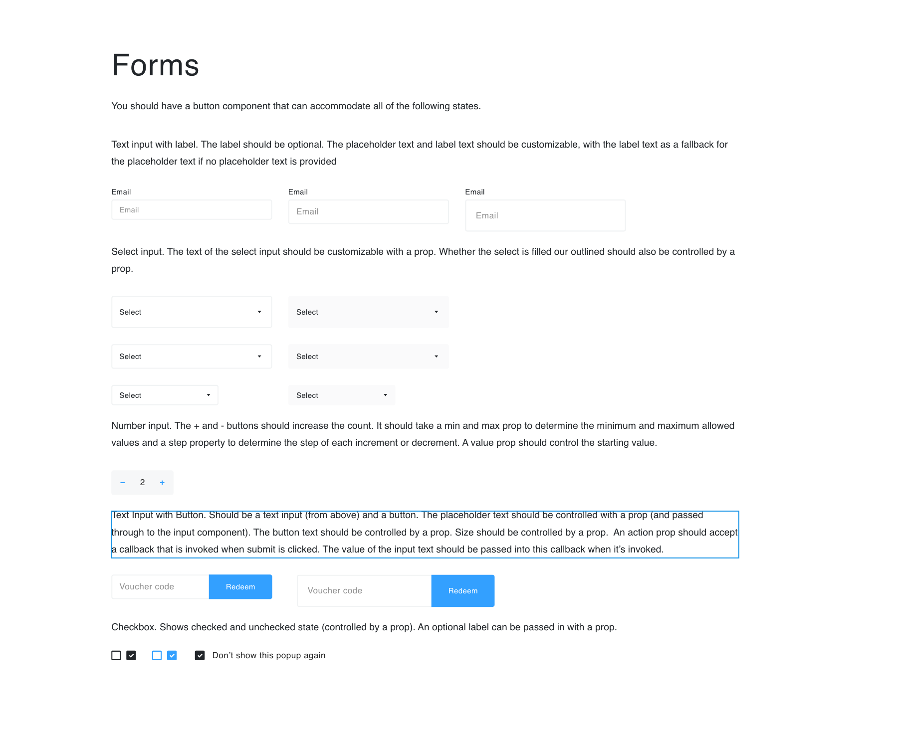

## My First React Storybook Project

I re-created the look of the Buttons and Forms components provided for me on the images bellow. 

## Built With

* React

## Authors

* **Anderson Guerrero** - *agmontilla08@gmail.com* 

## How To run

In the project directory, you can run:

### `npm start`

Runs the app in the development mode. 
Open [http://localhost:3000](http://localhost:3000) to view it in the browser.

The page will reload if you make edits.

### `npm run eject`

To exit 

